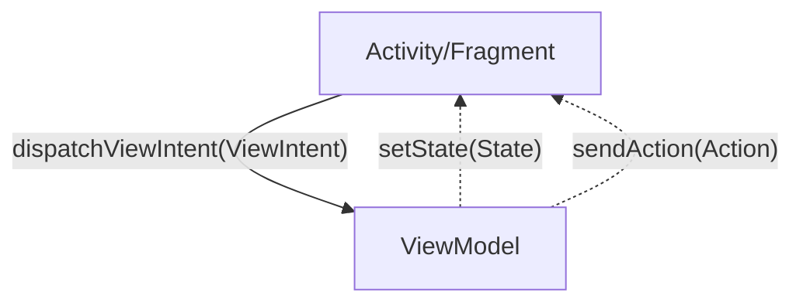

# <p align="center">AbasteceAi</p>

<p align="center">
    
    
</p>

[](docs/aa_icon_nobg.png)

## 💬 About

This project was developed to help people decide which fuel to use in their vehicles, based on the current price and the efficiency of each fuel.

## :computer: Technologies & Techniques

- [Kotlin](https://kotlinlang.org/)
- [Android Studio](https://developer.android.com/studio)
- [Android Jetpack](https://developer.android.com/jetpack)
- [Retrofit](https://square.github.io/retrofit/)
- [Room](https://developer.android.com/topic/libraries/architecture/room)
- [Modularization](https://jeroenmols.com/blog/2019/04/02/modularizationexample/)
- [Clean Architecture](https://proandroiddev.com/kotlin-clean-architecture-1ad42fcd97fa)
- [MVVM](https://developer.android.com/jetpack/guide)
- [Conventional Commits](https://www.conventionalcommits.org/en/v1.0.0/)


## :rocket: Features

- [x] Compare fuel by efficiency with the current price
- [ ] History of fuel comparisons
- [ ] Register new fuel
- [ ] News about fuels
- [ ] Customization (theme, language)
- [ ] Register new vehicle
- [ ] Backup/Restore data
- [ ] Share fuel comparison

## :building_construction: Architecture

### Wireframe flow

[](docs/app_wireframe_flow.jpg)

### Use Case Diagram

[](docs/app_use_cases.png)

### :package: Modules

[](docs/project.dot.png)

### ViewIntent



## :scroll: Requirements

- [Android Studio](https://developer.android.com/studio)
- [Java 11](https://www.oracle.com/java/technologies/javase-jdk11-downloads.html)

## :cd: Installation

```sh
git clone git@github.com:filipe1309/AbasteceAi.git
```

```sh
cd AbasteceAi
```

## :runner: Running

```sh
./gradlew run
```

### :gear: Gradle Tasks

### Generate project dependency graph
```sh
 ./gradlew projectDependencyGraph
```

> Then, open Project module dependency graph created at `/build/reports/dependency-graph/project.dot.png`

## :link: References

- https://developer.android.com/guide/navigation/navigation-getting-started
- https://www.youtube.com/watch?v=2k8x8V77CrU
- https://jeroenmols.com/blog/2019/04/02/modularizationexample/
- https://www.youtube.com/watch?v=PZBg5DIzNww
- https://developer.android.com/topic/modularization
- https://developer.android.com/topic/modularization/patterns
- https://developer.android.com/studio/build/configure-app-module
- https://jeroenmols.com/blog/2019/06/12/modularizationtips/#dependency-management
- https://handstandsam.com/2018/02/11/kotlin-buildsrc-for-better-gradle-dependency-management/
- https://proandroiddev.com/supercharge-android-mvvm-part-1-viewstate-and-actionstate-5816500580ed
- https://proandroiddev.com/supercharged-android-mvvm-input-stream-c117073760d7
- https://medium.com/android-news/android-architecture-communication-between-viewmodel-and-view-ce14805d72bf
- https://proandroiddev.com/viewstate-and-interactions-an-easy-contract-between-view-and-viewmodel-17cdfbd733c7
- https://developer.android.com/develop/ui/views/components/floating-action-button
- https://www.youtube.com/watch?v=Qxj2eBmXLHg
- https://developer.android.com/topic/libraries/architecture/viewmodel/viewmodel-factories
- https://www.youtube.com/watch?v=6Jc6-INantQ
- https://medium.com/swlh/mvi-architecture-with-android-fcde123e3c4a
- https://iamjegul.medium.com/android-database-in-multi-module-project-35513c8621ce
- https://betterprogramming.pub/how-to-use-ksp-on-android-f7df3a87d05e
- https://github.com/google/ksp
- https://developer.android.com/jetpack/androidx/releases/room
- https://developer.android.com/training/data-storage/room/prepopulate
- https://stackoverflow.com/questions/53152796/androidx-room-unresolved-supertypes-roomdatabase
- https://developer.android.com/training/data-storage/room/async-queries
- https://developer.android.com/training/data-storage/room/referencing-data
- https://medium.com/androiddevelopers/packing-the-room-pre-populate-your-database-with-this-one-method-333ae190e680
- https://www.youtube.com/watch?v=pe28WeQ0VCc

<!-- ## :white_check_mark: Tests

After up the container:

```sh
docker-compose exec -t {{ CONTAINER_SERVICE_NAME }} ./vendor/bin/phpunit
```

## Contributing

Pull requests are welcome. For major changes, please open an issue first to discuss what you would like to change.

Please make sure to update tests as appropriate. -->

## License

[MIT](https://choosealicense.com/licenses/mit/)

## About Me

<p align="center">
    <a style="font-weight: bold" href="https://github.com/filipe1309/">
    
    </a>
</p>

---

<p align="center">
    Done with&nbsp;&nbsp;:heart:&nbsp;&nbsp;by <a style="font-weight: bold" href="https://github.com/filipe1309/">filipe1309</a> 🖖
</p>

---

> @ Generated with [ShubcoGen Template™](https://github.com/filipe1309/shubcogen-template)  

