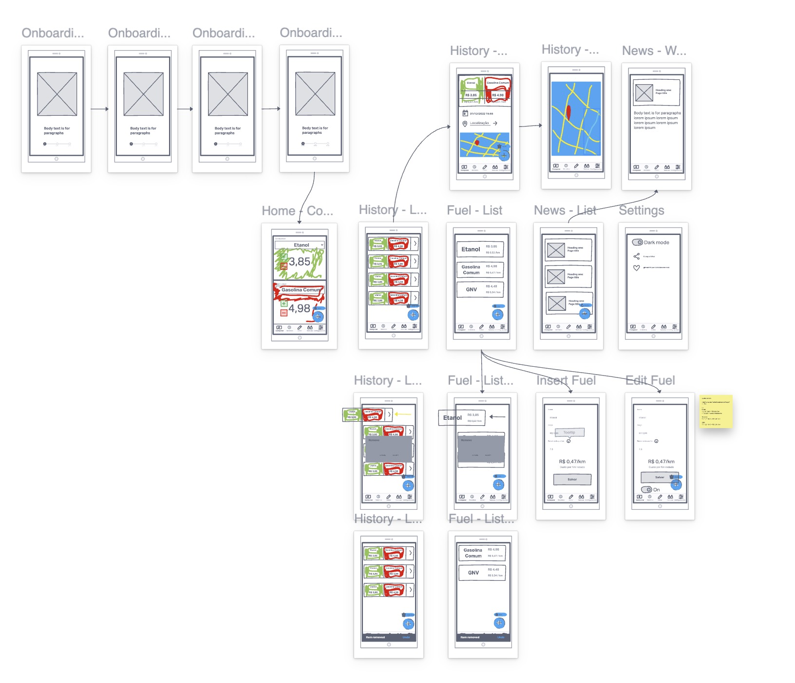
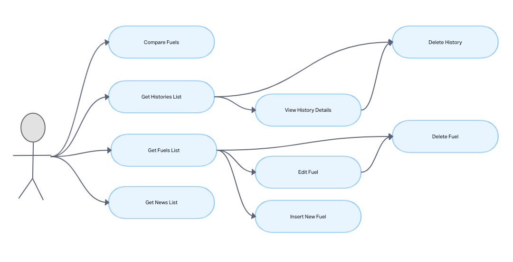
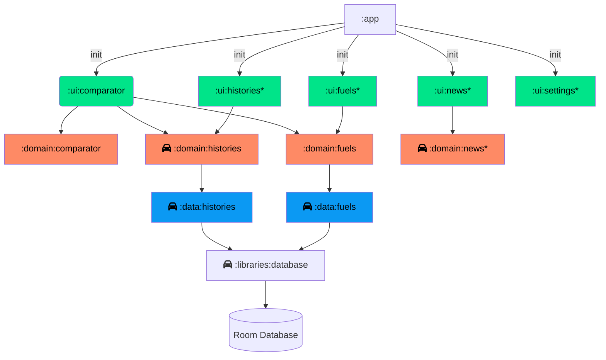
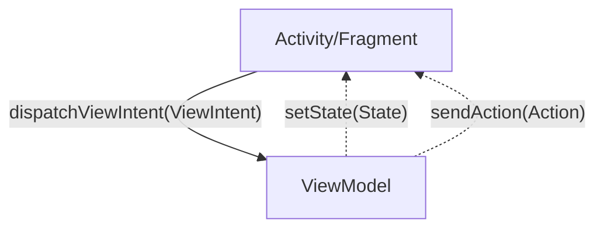

# <p align="center">AbasteceAi</p>

<p align="center">
    
    
</p>

[](docs/aa_icon_nobg.png)

## 💬 About

This project was developed to help people decide which fuel to use in their vehicles, based on the current price and the efficiency of each fuel.

## :computer: Technologies & Techniques

- [Kotlin](https://kotlinlang.org/)
- [Android Studio](https://developer.android.com/studio)
- [Android Jetpack](https://developer.android.com/jetpack)
- [Retrofit](https://square.github.io/retrofit/)
- [Room](https://developer.android.com/topic/libraries/architecture/room)
- [Modularization by feature & by layer](https://www.youtube.com/watch?v=16SwTvzDO0A)
- [Clean Architecture](https://proandroiddev.com/kotlin-clean-architecture-1ad42fcd97fa)
- [MVVM](https://developer.android.com/jetpack/guide)
- [Conventional Commits](https://www.conventionalcommits.org/en/v1.0.0/)
- [Koin](https://insert-koin.io/)

## :rocket: Features

- [x] Compare fuel by efficiency with the current price
- [x] Save comparison in history
- [x] Save comparison price
- [x] Predefined fuels

## :round_pushpin: Roadmap

- [ ] History of fuel comparisons
- [ ] Register new fuel
- [ ] News about fuels
- [ ] Customization (theme, language)
- [ ] Register new vehicle
- [ ] Backup/Restore data
- [ ] Share fuel comparison

## :building_construction: Architecture

### Wireframe flow

[](docs/app_wireframe_flow.jpg)

### Use Case Diagram

[](docs/app_use_cases.png)

### :package: Modules by feature & by layer



### ViewIntent



## :scroll: Requirements

- [Android Studio](https://developer.android.com/studio)
- [Java 11](https://www.oracle.com/java/technologies/javase-jdk11-downloads.html)

## :cd: Installation

```sh
git clone git@github.com:filipe1309/AbasteceAi.git
```

```sh
cd AbasteceAi
```

## :runner: Running

```sh
./gradlew run
```

### :gear: Gradle Tasks

### Generate project dependency graph
```sh
 ./gradlew projectDependencyGraph
```

> Then, open Project module dependency graph created at `/build/reports/dependency-graph/project.dot.png`

## :link: References

- [Modularization - Why you should care](https://jeroenmols.com/blog/2019/03/06/modularizationwhy/)
- [Modularization - A successful architecture](https://jeroenmols.com/blog/2019/03/18/modularizationarchitecture/)
- [Get started with the Navigation component](https://developer.android.com/guide/navigation/navigation-getting-started)
- [Single activity: Why, when, and how (Android Dev Summit '18)](https://www.youtube.com/watch?v=2k8x8V77CrU)
- [Modularization - Real-life example](https://jeroenmols.com/blog/2019/04/02/modularizationexample/)
- [Modularization - How to approach](https://jeroenmols.com/blog/2019/04/24/modularizationhow/)
- [Build a modular Android app architecture (Google I/O'19)](https://www.youtube.com/watch?v=PZBg5DIzNww)
- [Guide to Android app modularization](https://developer.android.com/topic/modularization)
- [Common modularization patterns](https://developer.android.com/topic/modularization/patterns)
- [Configure the app module](https://developer.android.com/studio/build/configure-app-module)
- [Modularization - Lessons learned](https://jeroenmols.com/blog/2019/06/12/modularizationtips/)
- [Kotlin + buildSrc for Better Gradle Dependency Management](https://handstandsam.com/2018/02/11/kotlin-buildsrc-for-better-gradle-dependency-management/)
- [Android MVVM ViewModel’s output streams — ViewState and ActionState](https://proandroiddev.com/supercharge-android-mvvm-part-1-viewstate-and-actionstate-5816500580ed)
- [Android MVVM ViewModel’s Input Stream](https://proandroiddev.com/supercharged-android-mvvm-input-stream-c117073760d7)
- [Android Architecture: Communication between ViewModel and View](https://medium.com/android-news/android-architecture-communication-between-viewmodel-and-view-ce14805d72bf)
- [ViewState and Interactions — an easy contract between view and ViewModel](https://proandroiddev.com/viewstate-and-interactions-an-easy-contract-between-view-and-viewmodel-17cdfbd733c7)
- [Add a Floating Action Button](https://developer.android.com/develop/ui/views/components/floating-action-button)
- [What's new in architecture components (Google I/O'19)](https://www.youtube.com/watch?v=Qxj2eBmXLHg)
- [Create ViewModels with dependencies](https://developer.android.com/topic/libraries/architecture/viewmodel/viewmodel-factories)
- [StateFlow vs. Flow vs. SharedFlow vs. LiveData... When to Use What?! - Android Studio Tutorial](https://www.youtube.com/watch?v=6Jc6-INantQ)
- [MVI Architecture with Android](https://medium.com/swlh/mvi-architecture-with-android-fcde123e3c4a)
- [Database in a Multi-module Android Project](https://iamjegul.medium.com/android-database-in-multi-module-project-35513c8621ce)
- [How to Use Kotlin Symbol Processors on Android](https://betterprogramming.pub/how-to-use-ksp-on-android-f7df3a87d05e)
- [Kotlin Symbol Processing API](https://github.com/google/ksp)
- [Room](https://developer.android.com/jetpack/androidx/releases/room)
- [Prepopulate your Room database](https://developer.android.com/training/data-storage/room/prepopulate)
- [AndroidX Room unresolved supertypes RoomDatabase](https://stackoverflow.com/questions/53152796/androidx-room-unresolved-supertypes-roomdatabase)
- [Write asynchronous DAO queries](https://developer.android.com/training/data-storage/room/async-queries)
- [Referencing complex data using Room](https://developer.android.com/training/data-storage/room/referencing-data)
- [Packing the Room: pre-populate your database with this one method](https://medium.com/androiddevelopers/packing-the-room-pre-populate-your-database-with-this-one-method-333ae190e680)
- [Pre-Populate ROOM Database with Already Loaded Data | Android Studio Tutorial](https://www.youtube.com/watch?v=pe28WeQ0VCc)
- [By layer or feature? Why not both?! Guide to Android app modularization](https://www.youtube.com/watch?v=16SwTvzDO0A)
- [MermaidJS](https://mermaid.js.org/syntax/flowchart.html)
- [Mermaid Live Editor](https://mermaid.live/)
- [Kotlin dependency injection: Koin vs. Hilt](https://blog.logrocket.com/kotlin-dependency-injection-koin-vs-hilt/)
- [Koin](https://insert-koin.io/)
- [The Ultimate Guide to Koin (Dependency Injection with Kotlin) - Android Studio Tutorial](https://www.youtube.com/watch?v=EathumJlWh8)

<!-- ## :white_check_mark: Tests

After up the container:

```sh
docker-compose exec -t {{ CONTAINER_SERVICE_NAME }} ./vendor/bin/phpunit
```

## Contributing

Pull requests are welcome. For major changes, please open an issue first to discuss what you would like to change.

Please make sure to update tests as appropriate. -->

## License

[MIT](https://choosealicense.com/licenses/mit/)

## About Me

<p align="center">
    <a style="font-weight: bold" href="https://github.com/filipe1309/">
    
    </a>
</p>

---

<p align="center">
    Done with&nbsp;&nbsp;:heart:&nbsp;&nbsp;by <a style="font-weight: bold" href="https://github.com/filipe1309/">filipe1309</a> 🖖
</p>

---

> @ Generated with [ShubcoGen Template™](https://github.com/filipe1309/shubcogen-template)  

